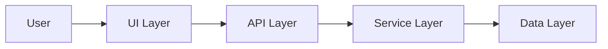
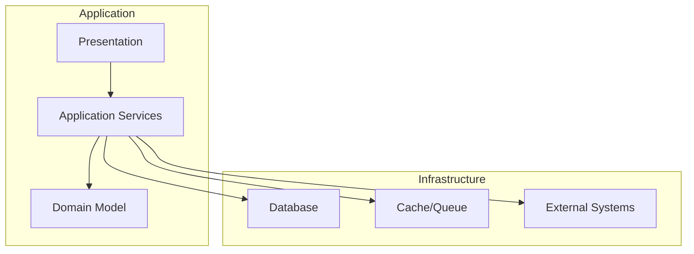

# CoraWiki Research Report

- Query: 分析下 /Users/ruska/project/Cora 的整体架构并生成报告
- Started At: 2026-03-01T15:53:08.556Z
- Ended At: 2026-03-01T15:55:41.879Z
- Debug Log: /Users/ruska/project/Cora/.cora/logs/corawiki-run-20260301-235308.txt
- Token Usage: prompt=39630, completion=3532, total=43162, cached=0

## What is Cora?

Cora 是本次被分析的目标系统。当前报告围绕其关键代码路径展开，基于 16 个核心源码文件形成结构化结论。

主要功能与模块概览：
- cora - VSCode AI研究助手扩展主包
- corawiki核心模块 - 包含ResearchController、LLMClient、CacheStore、ReportGenerator等
- commands模块 - VSCode命令注册
- providers模块 - 页面树等UI提供者
- services模块 - 业务服务抽象
- listeners模块 - 事件监听
- utils模块 - 工具函数

## Overview

Cora是一个基于VSCode的AI研究助手扩展（版本0.2.0），采用模块化架构设计。核心功能由corawiki子模块提供，包含研究控制器、AI客户端（支持Anthropic和OpenAI）、缓存管理、报告生成等能力。整体架构遵循VSCode扩展标准模式，通过commands、providers、listeners等模块实现功能扩展。

## System Architecture Overview

架构上主要特点：**整体架构类型**：VSCode扩展应用 **核心模块划分**：按功能职责分层



### Key Code Entities

- **整体架构类型**: VSCode扩展应用
  - package.json中main字段指向./out/extension.js
  - extension.ts是主入口文件，imports 15个模块包括vscode、PageTreeProvider等VSCode特有模块
- **核心模块划分**: 按功能职责分层
  - src/commands - 命令处理层
  - src/corawiki - 核心业务逻辑层
- **corawiki核心子系统**: AI研究助手功能封装
  - researchController.ts - 研究流程控制，imports 9个模块
  - llmClient.ts - AI客户端，支持Anthropic和OpenAI
- **入口点配置**: 标准的VSCode扩展结构
  - 主入口：out/extension.js
  - 命令入口：out/commands/index.js
- **依赖技术栈**: Node.js + TypeScript + AI SDK
  - 依赖@anthropic-ai/sdk
  - 依赖openai

## Core Components

### Module Responsibilities

- cora - VSCode AI研究助手扩展主包
- corawiki核心模块 - 包含ResearchController、LLMClient、CacheStore、ReportGenerator等
- commands模块 - VSCode命令注册
- providers模块 - 页面树等UI提供者
- services模块 - 业务服务抽象
- listeners模块 - 事件监听
- utils模块 - 工具函数

### Critical Flows

- **扩展激活流程**: 1. VSCode加载extension.js主入口 → 2. 通过extension.ts的activate函数初始化 → 3. 注册PageTreeProvider等UI组件 → 4. 注册commands命令 → 5. 初始化corawiki核心模块
  - extension.ts imports包含vscode、PageTreeProvider、ResearchController等
  - package.json main字段配置
- **研究任务执行流程**: 1. 用户触发Research命令 → 2. researchController接收请求 → 3. 调用llmClient与AI交互 → 4. 使用treeBuilder构建内容树 → 5. 通过reportGenerator生成报告 → 6. 缓存结果到cacheStore
  - researchController.ts imports 9个相关模块
  - llmClient.ts支持多AI提供商

### Architecture Findings

- **整体架构类型**: VSCode扩展应用
- **核心模块划分**: 按功能职责分层
- **corawiki核心子系统**: AI研究助手功能封装
- **入口点配置**: 标准的VSCode扩展结构
- **依赖技术栈**: Node.js + TypeScript + AI SDK

## Data Flow



## Key File Structure

```
├── out
│   ├── commands
│   │   └── index.js
│   ├── corawiki
│   │   ├── index.js
│   │   └── tools.js
│   └── extension.js
├── package.json
└── src
    ├── commands
    │   └── index.ts
    ├── corawiki
    │   ├── cacheStore.ts
    │   ├── index.ts
    │   ├── llmClient.ts
    │   ├── reportGenerator.ts
    │   ├── researchController.ts
    │   ├── researchLogger.ts
    │   ├── tools.ts
    │   ├── treeBuilder.ts
    │   ├── treeValidator.ts
    │   └── types.ts
    ├── extension.ts
    └── test
        └── suite
```

## 总结

Cora是一个基于VSCode的AI研究助手扩展（版本0.2.0），采用模块化架构设计。核心功能由corawiki子模块提供，包含研究控制器、AI客户端（支持Anthropic和OpenAI）、缓存管理、报告生成等能力。整体架构遵循VSCode扩展标准模式，通过commands、providers、listeners等模块实现功能扩展。

- 风险: 缺少package.json完整内容（无法确定完整依赖关系和配置细节）
- 风险: 部分模块未获取代码内容（无法详细分析commands、providers、services等模块实现）
- 待澄清: 具体命令实现细节
- 待澄清: PageTreeProvider UI实现
- 待澄清: test模块具体内容

---
分析报告产出来自于 Cora
