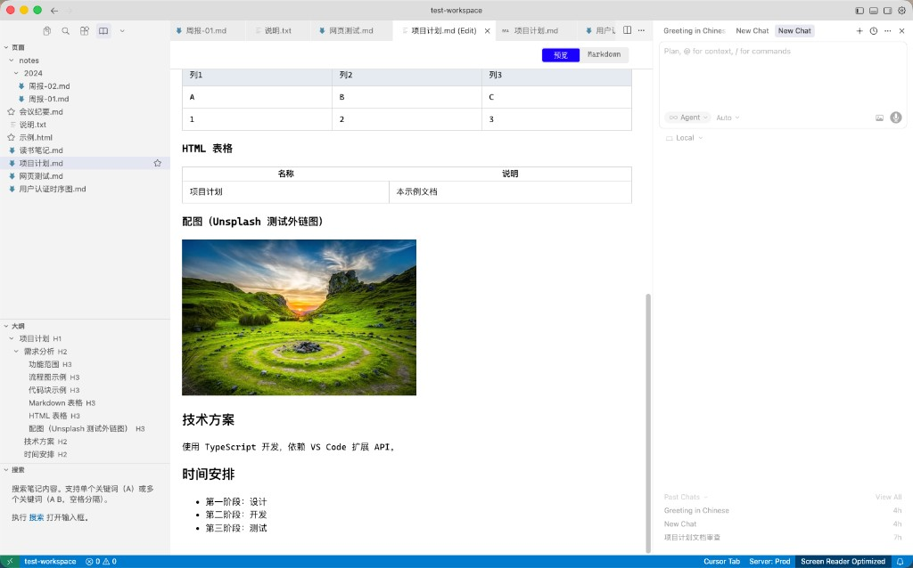
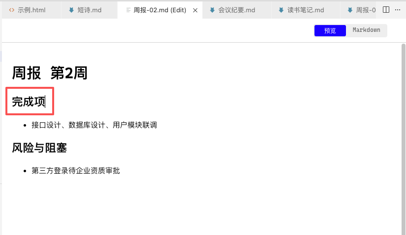
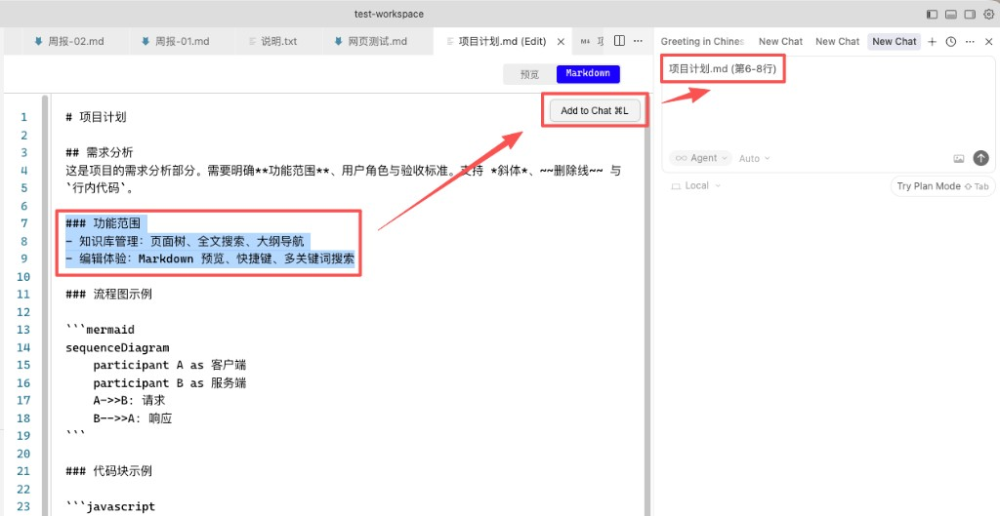
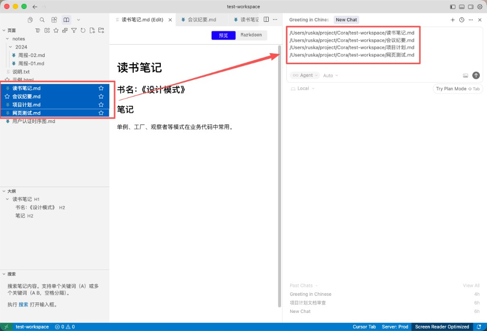
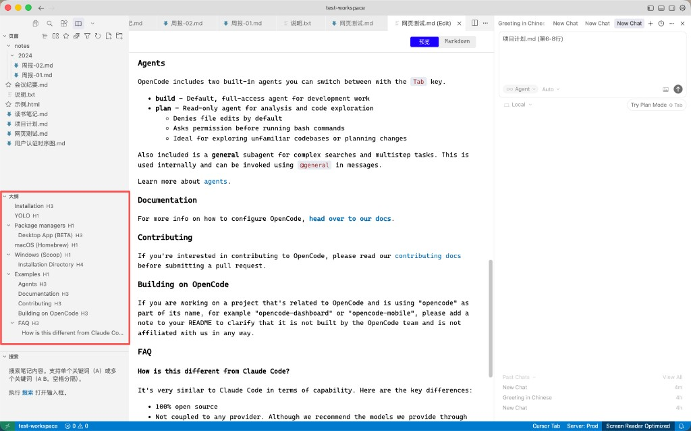
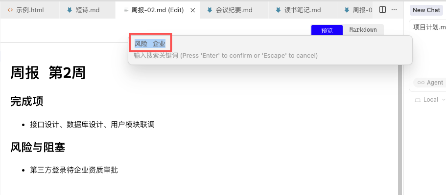
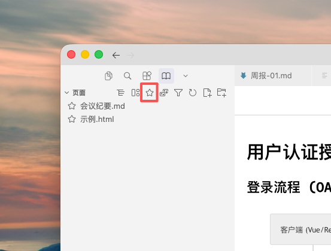
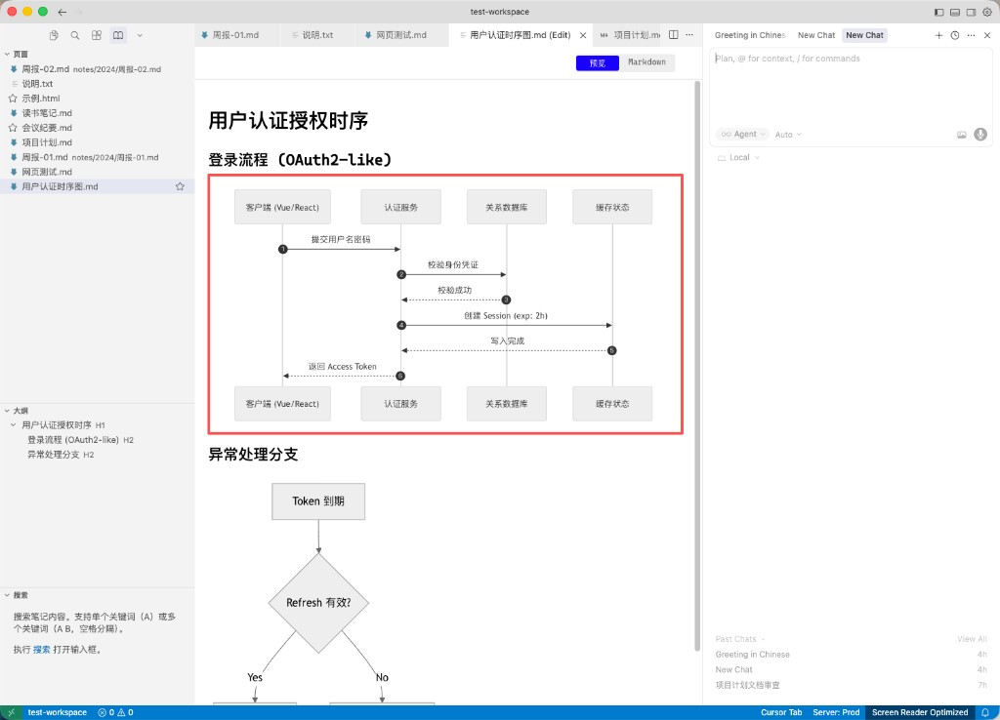
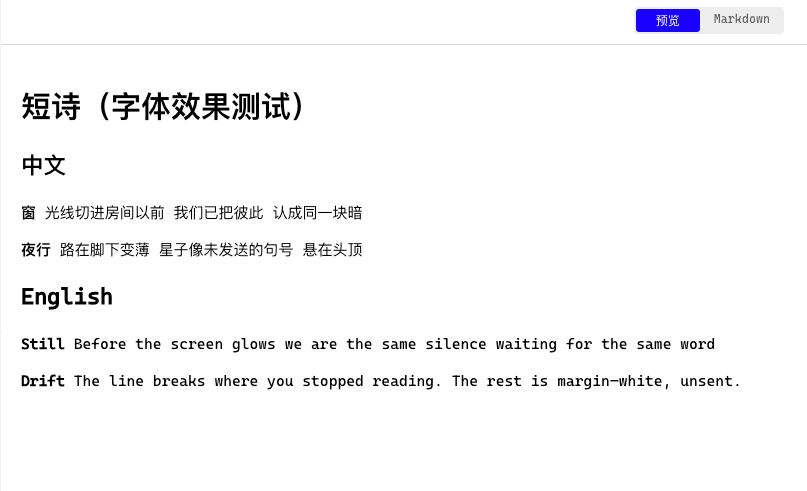

# Cora

一款受 Notion 启发的 VS Code 知识管理插件，同时为 Cursor / AI 编程场景提供「读、找、懂、规划」的配合能力：更好的文档阅读与导航、项目级代码理解（CoraWiki，实验功能）、以及规范的 Plan 书写（Plan 增强，实验功能，可选）。

## 为什么选择 Cora？

VS Code 和 Cursor 的界面是为编程设计的——左侧文件树、中间编辑器、右侧 AI 对话。这种布局对编程很友好，但对知识管理并不理想。

Notion 擅长知识管理：层级页面、文档大纲、全文搜索。但它缺少 VS Code 强大的编辑能力和 AI 集成。

Cora 将两者结合。在 Cursor 中使用时，Cora 还帮助 AI 更好地理解项目与书写可执行的 Plan。

* 📁 **页面树** —— 层级化的知识组织，像 Notion 一样直观

* 📋 **大纲视图** —— 一键导航文档结构，支持层级折叠

* 🔍 **全文搜索** —— 支持多关键词、智能降级搜索

* 📝 **无缝编辑** —— 编辑/预览一键切换，保留 VS Code 原生体验

## 为谁设计？

* **开发者兼知识工作者** —— 用一个工具搞定代码和笔记

* **在 Cursor 中做 AI 辅助开发的开发者** —— 需要更好的文档阅读、项目理解与 Plan 规范

* **非技术背景的知识工作者** —— 借助 AI 编程的力量，更高效地管理知识

## 使用场景

| 场景      | 传统方式     | Cora 方式         |
| ------- | -------- | --------------- |
| 整理项目文档  | 文件夹嵌套混乱  | 层级化页面树，一目了然     |
| 阅读长文档   | 滚动找内容    | 大纲导航，秒跳目标章节     |
| 查找笔记    | 逐个文件打开搜索 | 全文搜索，关键词高亮      |
| 切换编程/写作 | 两个应用来回切  | 一个 VS Code，两种模式 |

## 核心设计理念

保留 VS Code 的编辑能力，增加 Notion 的组织能力。

* 左侧面板增加知识库视图，随时可切回原生文件树

* 中间区域仍用 VS Code 编辑器，预览/编辑一键切换

* 右侧 AI 对话保持不变，与知识库无缝配合

## Cora 与 AI 编程

Cora 为 Cursor / AI 编程提供四条能力，让人与 AI 在同一工作区内更好地协作：

| 能力 | 产品形态 | 为 AI 编程 / Cursor 带来的价值 |
|------|----------|-------------------------------|
| **读** | 页面树、大纲 | 更好的 MD/Plan 阅读与跳转；AI 引用文档时结构清晰。 |
| **找** | 全文搜索 | 快速定位文件与片段；为 AI 提供「按描述找文件」的前置。 |
| **懂** | CoraWiki（实验功能） | 理解整仓代码并生成架构报告；未来通过 MCP 为 Cursor AI 提供更深上下文。 |
| **规划** | Plan 书写约束（实验功能，可选） | 写 Plan 时有结构、可验收；测试与功能同步开发，每模块须有单元测试与 e2e，测试通过后才可更新任务；AI 写 plan 时先读约束，输出更一致。 |

## 产品特性

以下按「先整体、再核心体验、后锦上添花」的顺序展示 Cora 的主要使用方式与界面。

### 1. 整体界面

左侧为知识库面板（**页面**树、**大纲**、**搜索**），中间为 Markdown 编辑与预览，右侧为 AI 对话。一份工作区即可完成文档整理、阅读、检索与 AI 协作。

* **左侧**：页面树（层级/平铺/收藏）、文档大纲、全文搜索

* **中间**：预览 / Markdown 双模式，支持表格、外链图等

* **右侧**：AI 对话与历史会话，与当前文档协同

### 2. 预览即编辑（所见即所得）

在 **预览** 模式下即可**直接编辑**文档内容，无需切回源码：改字、选段、划词送 AI 都在同一视图内完成，类似 Typora 的沉浸式体验。

* **预览即编辑**：标签页显示「(Edit)」，预览界面内可直接修改正文

* **一键切换**：通过「预览」/「Markdown」按钮在渲染视图与源码间切换

### 3. 划词 Add to Chat

在预览或 Markdown 模式下**选中一段文字**，点击 **Add to Chat**（或 `⌘L`），即可将选中内容作为「文件 + 行范围」引用送入右侧 AI 对话，无需复制粘贴全文。

* **选中即送**：划词后点 Add to Chat，对话中显示如「项目计划.md (第6-8行)」的定位引用

* **精准上下文**：AI 只收到你选中的片段，提问更聚焦、回答更贴题

### 4. 多选文件与 AI 对话结合

在页面树中 **Shift / Command 多选**多个文件，右键可**批量复制绝对路径或相对路径**；多选后的文件路径可直接作为 AI 对话的上下文，让 AI 同时阅读多份笔记。

* **多选 + 路径**：树状/平铺下多选，右键复制路径；AI 侧可引用多文件

* **多文档协同**：一次选中多篇文档，便于对比、汇总或让 AI 跨文档分析

### 5. 大纲的实时显示

左侧 **大纲** 面板随当前文档**实时解析**标题结构（H1～H4），可展开/折叠。切换文档或编辑时自动更新，长文档内快速跳转。

* **层级标识**：标题旁标注 H1、H3、H4 等，结构一目了然

* **点击跳转**：点击大纲项定位到对应位置；预览/编辑下均实时同步

### 6. 多关键词同时搜索

【搜索】面板支持**多关键词**（空格分隔），按 Enter 后在工作区 Markdown 中查找**同时包含**这些词的文档；无结果时自动降级为 OR 搜索。

* **多词 AND**：如「风险 企业」只显示同时包含两词的笔记

* **匹配统计**：结果列表展示匹配次数与预览片段，便于快速定位

### 7. CoraWiki：工作区架构分析（实验功能）

【CoraWiki】为实验功能。面板可对当前工作区进行**架构分析**，生成结构化报告（概述、模块职责、关键流程、风险与引用等）。在 Cursor 中使用时，报告为 AI 提供项目级理解；未来计划通过 MCP 向 Cursor 提供更深上下文，让 AI 编码获得更多辅助信息。

* **一键分析**：在 Cora 面板选择「开始分析当前工作区架构」，等待完成后打开报告

* **报告与引用**：报告中的文件引用可点击跳转，便于人与 AI 对照代码

### 8. Plan 书写约束（实验功能，可选）

**Plan 增强**为实验功能。Cora 提供 **Plan 书写约束说明与模板**，帮助人与 AI 写出结构清晰、可验收的 Plan。约束中强调：**测试与功能必须同步开发**；每个模块都必须具备**单元测试与 e2e 测试**；**仅当测试全部通过后**才能将对应任务标记为完成，禁止在测试未通过时更新任务状态。在 Cursor 中可配合工作区内的约束与规则，实现「写 plan 时先读约束」，使 AI 输出的 Plan 更一致、可执行。后续版本可能提供「打开约束说明」命令或「从模板新建 Plan」等入口。

### 9. 支持收藏

在页面树中可将常用文档**收藏**，工具栏提供**收藏**视图；树状/平铺下悬停或右键即可「收藏」/「取消收藏」，已收藏项显示星标。

* **工具栏星标**：一键切换至收藏视图，只显示已收藏文件

* **文件旁星标**：已收藏的 MD/HTML 等在列表中带星标，可随时取消

### 10. Mermaid 代码渲染

预览模式下 Markdown 中的 **Mermaid** 代码块会实时渲染为时序图、流程图等，无需导出为图片。

* **时序图 / 流程图**：如登录流程、异常分支等，编辑后即可看到图表更新

* **一键切换**：预览 / Markdown 间切换，代码与图表对照方便

### 11. 美观的字体

预览与编辑均支持可配置**字体**，中英混排清晰。设置中可选用 Cascadia Mono、Google Sans、IBM Plex Mono、Noto Sans SC 等。

* **中英混排**：短诗、笔记等统一排版，字重与行距适中

* **可配置**：`knowledgeBase.fontFamily`、字号等可在设置中调整

***

 

## 快速开始

### 安装

1. 在 VS Code/Cursor 扩展市场中搜索 "Cora"
2. 点击安装
3. 安装完成后，左侧活动栏会出现 📖 **Cora** 图标

### 使用指南

1. **打开 Cora 面板**

   * 点击左侧活动栏的 📖 Cora 图标

   * 或使用快捷键 `Cmd+Shift+P` 输入 "Cora"

2. **浏览文件（页面树）**

   * 在【页面】标签中查看工作区文件树；默认**树状**展示文件夹层级，可切换为**平铺**（按修改时间排序）或**收藏**（仅已收藏文件）

   * 标题栏从左到右：树状、平铺、收藏、排序、筛选、刷新、新建笔记、新建文件夹；树形下可使用【全部/Markdown】过滤

   * 悬停或右键 MD 文件可「收藏」/「取消收藏」，已收藏项显示星标

   * 右键文件可进行各种操作

3. **查看文档结构（大纲）**

   * 打开任意 Markdown 文件

   * 切换到【大纲】标签查看文档标题结构

   * 点击标题项跳转到对应位置

   * 支持展开/折叠子标题

4. **搜索笔记**

   * 切换到【搜索】标签

   * 点击 🔍 **搜索笔记** 按钮

   * 输入关键词，支持多关键词（空格分隔）

   * 查看搜索结果，点击打开文件

5. **编辑与预览**

   * 点击 Markdown 文件 → 默认以预览模式打开

   * **Cursor**：点击内容区右上角 **Markdown** / **Preview** 按钮切换

   * **VS Code**：若无内联按钮，使用 `Cmd+Shift+V`（预览）、`Cmd+E`（编辑），或标题栏右侧图标切换

## 右键菜单功能

在页面树中右键点击文件或文件夹：

* **新建笔记** - 在当前目录创建新 Markdown 文件

* **新建文件夹** - 在当前目录创建新文件夹

* **收藏** / **取消收藏** - 将 Markdown 文件加入或移出收藏列表（悬停时也可点击星标）

* **重命名** - 重命名文件/文件夹

* **删除** - 删除文件/文件夹

* **在 Finder 中打开** - 打开系统文件管理器

* **复制绝对路径** - 复制完整文件路径

* **复制相对路径** - 复制相对于工作区的路径

* **复制文件** - 创建文件副本（自动命名）

## 搜索技巧

| 输入                | 说明        | 结果               |
| ----------------- | --------- | ---------------- |
| `项目`              | 单关键词      | 包含"项目"的所有笔记      |
| `项目 计划`           | 多关键词（AND） | 同时包含"项目"和"计划"的笔记 |
| `项目 计划`（无 AND 结果） | 智能降级（OR）  | 包含"项目"或"计划"的笔记   |

## 配置选项

在 VS Code 设置中搜索 "knowledgeBase" 进行配置：

| 配置项                                | 类型      | 默认值                            | 说明                                                    |
| ---------------------------------- | ------- | ------------------------------ | ----------------------------------------------------- |
| `knowledgeBase.filterMode`         | string  | `"markdown"`                   | 页面树的文件过滤模式（树形下生效）                                     |
| `knowledgeBase.pageViewMode`       | string  | `"tree"`                       | 页面展示模式：`tree` 树形层级，`flat` 平铺按修改时间排序，`favorites` 仅收藏列表 |
| `knowledgeBase.markdownExtensions` | array   | `[".md", ".markdown", ".mdx"]` | 识别的 Markdown 文件扩展名                                    |
| `knowledgeBase.autoReveal`         | boolean | `true`                         | 自动在页面树中显示当前打开的文件                                      |

## Roadmap

以下为计划中的功能，将按优先级逐步实现。

### 已提供 / 持续增强（含实验功能）

* **CoraWiki**（实验功能）：工作区架构分析已提供；持续优化报告质量与多轮研究能力。

* **Plan 增强**（实验功能）：Plan 书写约束文档与模板作为产品能力，约束要求测试与功能同步开发、每模块单元测试与 e2e、测试通过后才可更新任务；后续可能提供「打开约束说明」命令或「从模板新建 Plan」入口。

### 基础功能

* **MD 标准化**：一键将 Markdown 文件标准化，自动修复大模型生成内容中的常见格式问题，例如：

  * 强调符（粗体/斜体）前后空格

  * 表格分隔行与对齐

  * Mermaid 代码块语法错误等

### AI 与集成

* **MCP**：为 Cursor 等提供项目理解、Plan 约束等能力，让 AI 编码获得更深上下文。

* **Skill 生成**：利用 AI 对整个仓库或指定代码进行分析，总结出可复现代码的 Skill 文档。

* **架构图生成**：与 CoraWiki 协同，利用 AI 分析仓库代码架构，自动总结并输出架构图（如 Mermaid 等）。

## 语言 / 更新日志

* [简体中文](./README.md) · [更新日志](./CHANGELOG.md)

* [English](./README_EN.md) · [Changelog](./CHANGELOG_EN.md)

## 许可证

MIT

Cora —— 知识管理与 AI 编程，一个工作区搞定；在 Cursor 中更好地读、找、懂、规划。
