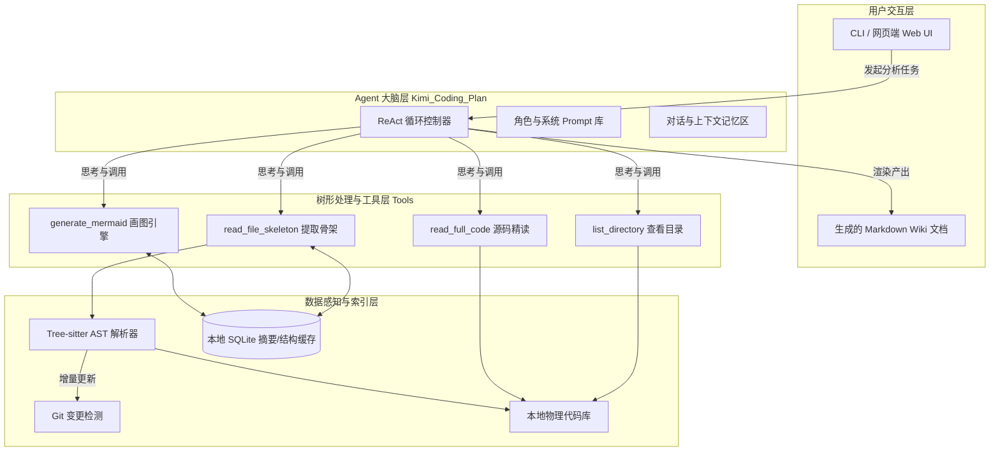

# CoraWiki 产品与技术架构设计文档（PRD & Design Doc）

这是一份为您深度定制的**产品与技术架构设计文档（PRD & Design Doc）**，完美融合了 PageIndex 的无向量树形结构、DeepWiki 的多轮 Agent 研究能力，以及 Kimi Coding Plan 的超长文本与工具调用能力。**第七节**对本地参考项目 DeepWiki-Open 与 PageIndex 做了调研小结，便于实现时对齐术语与选型。

---

## 一、背景 (Background)

在处理中大型或遗留代码库时，开发者通常面临“只见树木，不见森林”的困境。

1. **传统 RAG 的局限：** 依赖固定长度分块（Chunking）和向量检索（Vector Search），这会切断代码的逻辑链路。搜索“数据库连接”可能返回几十个毫无关联的代码片段，无法还原业务流。
2. **传统静态工具的局限：** 像 Doxygen 或 Source Trail 只能生成基于符号调用的类图，无法理解“设计意图”、“权衡（Trade-offs）”和“业务背景”。
3. **安全与成本考量：** 核心业务代码不能随意全部丢给云端大模型；且全量分析 10 万行代码的 Token 成本极高。

**CoraWiki 的诞生：** 结合 PageIndex 的“树形逻辑导航”与 DeepWiki 的“主动探索 Agent”，构建一个能在本地“看目录、读骨架、按需深挖代码”的智能体系统，最终输出高维度的架构级 Wiki 文档。

---

## 二、目标 (Objectives)

1. **非线性到线性的转化：** 将网状的复杂代码库，转化为层次清晰、自底向上的可读 Wiki 百科（Repository -> Module -> File -> Entity）。
2. **深度逻辑追踪：** 能够像人类高级架构师一样，回答跨越多层的复杂业务问题（如：“一个带有促销码的订单是如何最终入库的？”）。
3. **自动化架构图生成：** 基于代码真实逻辑，自动生成 Mermaid 格式的交互式系统架构图、数据流图和时序图。
4. **低成本本地优先：** 提取本地 AST（抽象语法树）作为轻量级骨架缓存，只有在深入研究时才提取具体文件源码，最大化利用大模型额度。

---

## 三、需求点 (Requirements List)

| 需求 ID | 模块/分类 | 需求描述 | 优先级 |
| :--- | :--- | :--- | :--- |
| **REQ-01** | **代码解析** | 支持多语言（Python, TS/JS, Java, Go等）的 AST 解析，提取类、函数、出入参及 Import 关系。 | **P0** |
| **REQ-02** | **树形索引** | 构建无向量的实体树（CodeTree），并支持将结果本地缓存（SQLite/JSON），避免重复分析。 | **P0** |
| **REQ-03** | **Agent 工具** | 封装 `list_dir`, `read_skeleton`, `read_full_code` 等工具，供 LLM 主动调用。 | **P0** |
| **REQ-04** | **分层摘要** | 实现自底向上（Bottom-up）的递归摘要生成机制，子节点摘要合并为父节点摘要。 | **P1** |
| **REQ-05** | **深度研究** | 实现基于 ReAct 循环的多轮迭代研究，支持 Agent 追踪最多 15 跳的调用链路。 | **P0** |
| **REQ-06** | **图表生成** | 根据 Agent 的研究上下文，自动使用 Mermaid.js 语法生成准确的模块关系图。 | **P1** |
| **REQ-07** | **交互展示** | 最终输出标准化的 Markdown 产物集，支持被任意静态站点生成器（如 VitePress）渲染。 | **P2** |
| **REQ-14** | **侧边栏入口** | 在左侧 Activity Bar 中将 CoraWiki 作为第 4 个入口，位于“页面 / 大纲 / 搜索”之后，保持现有三个入口顺序不变。 | **P0** |

---

## 四、需求详情 (Requirement Details)

### 4.1 树形逻辑索引机制 (Tree-based Reasoning)

* 放弃传统的文本 Chunking 方案。代码库被抽象为一棵严格的树：
  * `Node Level 1`: 核心领域目录（如 `src/auth`, `src/order`）
  * `Node Level 2`: 物理文件（如 `login_service.py`）
  * `Node Level 3`: 语义实体（如 `class LoginService`, `def verify_token`）
* Agent 寻找答案时，从根节点出发，通过阅读子节点的 `summary`（摘要），决定应该深入哪个分支（类似于人类查字典）。

### 4.2 Agentic 深度研究 (Deep Research)

* **触发条件：** 当用户提出高维问题（如“描述鉴权流程”）时触发。
* **执行策略：** Agent 首先获取入口目录结构 -> 提取相关文件的骨架（Skeleton） -> 发现关键函数 `verify_jwt()` -> 使用工具读取该函数的完整源码 -> 发现它调用了 `RedisCache` -> 再次调用工具读取 `RedisCache` 的定义 -> 综合所有收集到的信息，生成答案。

### 4.3 智能降级与缓存保护

* 为防止过度消耗 API Token，如果 Agent 读取超过阈值（如连续探索 15 轮仍未找到答案），强制中断并要求基于现有收集的上下文作答。
* 所有生成的层级摘要（Summary）持久化在本地，源码未更改（依据 Git Hash 或文件 MD5）时，直接命中本地结构缓存。

### 4.4 交互入口位置约束（左侧第 4 位）

* CoraWiki 入口放置在左侧 Activity Bar，顺序固定为：
  1. 页面
  2. 大纲
  3. 搜索
  4. **CoraWiki（新增）**
* 不改变现有三个入口的相对顺序；CoraWiki 仅追加在第 4 位。
* 若后续新增更多入口，默认排在 CoraWiki 之后。

---

## 五、技术架构设计 (Architecture Design)



---

## 六、实现细节（按模块给出）

### 模块 1：本地感知模块 (Perception & AST Module)

**职责：** 充当 Agent 的“眼睛”，以极低的 Token 成本提供代码库的地图。

* **实现细节：**
  * 集成 `tree-sitter`。相比 Python 原生的 `ast`，它支持多语言跨平台。
  * **提取逻辑 (Skeleton Extraction)：** 当 Agent 调用 `read_file_skeleton("src/api.py")` 时，模块不返回源码全文，而是返回：

    ```text
    文件: src/api.py
    导入: [fastapi.APIRouter, src.db.get_session]
    类:
      - UserAPI (继承自 BaseAPI)
        方法: login, register
    函数:
      - init_routes
    ```

  * **缓存机制：** 计算文件的 SHA256，将提取的 Skeleton 和 LLM 生成的 Summary 存入 SQLite 的 `file_nodes` 表。

### 模块 2：树形结构管理与摘要模块 (Tree & Summary Module)

**职责：** 类似 PageIndex 的自底向上处理流。

* **实现细节：**
  * **叶子合并：** 遍历 AST 提取出的函数级别注释/逻辑，生成 `file_summary`。
  * **目录合并：** 将该目录下所有 `file_summary` 发送给 LLM：“这是 `auth` 目录下所有文件的摘要，请用 200 字总结 `auth` 模块的职责。” 生成 `module_summary`。
  * **全景合成：** 将所有 `module_summary` 合成 `README_Overview.md`。

### 模块 3：Agentic 核心调度模块 (Agent Orchestrator)

**职责：** 控制深度研究的主循环，负责工具调度和防死循环。

* **实现细节：**
  * **模型接入适配层：** 提供统一 `LLMClientAdapter`（OpenAI-compatible），支持 Kimi Coding Plan / OpenAI / OpenRouter 等模型端点切换；请求头与调用方式严格遵循官方允许的 Coding Agent 场景与文档约束。
  * **循环机制 (ReAct Loop)：**

    ```python
    # 伪代码逻辑
    step = 0
    while step < MAX_STEPS:
        response = llm.chat(messages, tools)
        if response.wants_tool_call():
            result = execute_local_tool(response.tool_args)
            messages.append(tool_result)
        else:
            return response.final_answer
        step += 1
    ```

  * **结构化行动日志：** 不强制模型外显思维链；改为记录 `action -> tool -> evidence -> conclusion` 的结构化研究日志，用于可追溯与调试。

### 模块 3.1：Tool Calling 执行闭环（Agent 与普通 Chatbot 的核心差异）

**结论：** CoraWiki 不是“纯问答 chatbot”，而是带本地工具调用能力的 Agent。  
无工具时，模型只能基于历史上下文“猜”；有工具时，模型可以真实“读目录/读骨架/读源码”后再回答。

* **标准执行闭环（Observe -> Think -> Act）：**
  1. 系统注册工具（`list_dir`、`read_skeleton`、`read_full_code`）
  2. LLM 返回 `tool_call`（而非直接自然语言答案）
  3. 本地执行工具并回传结果
  4. 继续迭代，直到形成最终答案或达到步数上限

* **伪代码：**

  ```python
  while step < MAX_STEPS:
      resp = llm.chat(messages, tools=TOOLS)
      if resp.tool_calls:
          tool_result = run_local_tool(resp.tool_calls[0])
          messages.append({"role": "tool", "content": tool_result})
      else:
          return resp.final_answer
      step += 1
  ```

### 模块 3.2：Kimi Coding Plan Key 接入策略（整合讨论结论）

* **可用性判断：**
  * Kimi Coding Plan Key 面向 Coding Agent 场景，能力上适合本项目（长上下文 + Tool Calling）。
  * 是否可直接用于当前调用链，取决于官方最新策略与账户权限；实现上需做“可配置 + 可回退”。

* **接入原则：**
  1. 采用 OpenAI-compatible 客户端抽象，不把提供商细节散落在业务逻辑中。
  2. `baseURL`、`model`、`headers` 全部配置化，默认不写死。
  3. 若 Kimi 通道不可用，自动回退到备选 provider（如 OpenAI/OpenRouter）。
  4. 不依赖“绕过”方案；以官方文档允许方式接入。

* **建议配置项：**
  * `coraWiki.provider = kimi|openai|openrouter`
  * `coraWiki.baseUrl`
  * `coraWiki.model`
  * `coraWiki.apiKeyEnvName`（例如 `KIMI_API_KEY`）
  * `coraWiki.defaultHeaders`（可选）
  * `coraWiki.fallbackProvider`

### 模块 3.3：OpenAI SDK 接入规范（建议新增为标准实现）

* **目标：** 用一套 OpenAI SDK（Node.js）实现所有 provider 的统一 Tool Calling 调用。
* **建议实现：**
  * 依赖：`openai`（作为 OpenAI-compatible 客户端）
  * 封装文件：`src/corawiki/llmClient.ts`
  * 调用入口：
    * `createLLMClient(config)`：基于 `apiKey/baseURL/defaultHeaders` 初始化客户端
    * `chatWithTools(messages, tools)`：统一发起 `chat.completions.create(...)`
* **最小调用骨架：**

  ```ts
  import OpenAI from "openai";

  export function createLLMClient(cfg: {
    apiKey: string;
    baseURL: string;
    defaultHeaders?: Record<string, string>;
  }) {
    return new OpenAI({
      apiKey: cfg.apiKey,
      baseURL: cfg.baseURL,
      defaultHeaders: cfg.defaultHeaders,
    });
  }
  ```

* **验收标准：**
  1. 同一套 SDK 代码可切换 `kimi/openai/openrouter` 三种 provider。
  2. Tool Calling 可正常返回并执行本地工具结果。
  3. provider 不可用时，可按 `fallbackProvider` 自动降级。

### 模块 4：文档与可视化生成器 (Documentation & Visualization)

**职责：** 将 Agent 脑海里的网状理解转化为人类可读的线性文档和图表。

* **实现细节：**
  * **Wiki 页面生成：** 基于树形结构，输出多级 Markdown 文件：
    * `01-Overview.md` (全景架构)
    * `02-Modules/` (各子系统说明)
    * `03-Deep-Dive/` (关键业务流的专项研究报告)
  * **Mermaid 引擎：** 在 Prompt 中提供 Mermaid 编写规范。
    * 针对调用链生成：`sequenceDiagram`（时序图）
    * 针对模块依赖生成：`classDiagram`（类图/模块依赖图）
    * 针对状态机生成：`stateDiagram-v2`
  * **防幻觉处理：** 强制 LLM 在生成的文档中附带**代码行号或文件超链接**（例如：`[见 src/auth/login.py 第 45 行](./src/auth/login.py#L45)`），做到内容完全可溯源。

---

## 七、参考项目调研 (Reference Projects)

本节基于本地代码库 **DeepWiki-Open**（`/Users/ruska/开源项目/deepwiki-open`）与 **PageIndex**（`/Users/ruska/开源项目/PageIndex`）的调研整理，用于对齐术语、实现思路与差异化选型。

### 7.1 DeepWiki-Open 要点

| 维度 | 实现方式 | 代码/配置位置 |
|------|----------|----------------|
| **检索** | 向量 RAG：FAISS + Embedding（OpenAI/Google/Ollama），按 chunk 检索 | `api/rag.py`（FAISSRetriever）、`api/data_pipeline.py`（TextSplitter、ToEmbeddings） |
| **DeepResearch** | 多轮研究：最多 5 轮，每轮独立 RAG 检索 + 流式生成；通过 `[DEEP RESEARCH]` 标记与“继续研究”触发 | `api/simple_chat.py`、`api/websocket_wiki.py`；`api/prompts.py`（DEEP_RESEARCH_FIRST/INTERMEDIATE/FINAL_ITERATION_PROMPT） |
| **上下文** | 每轮用 RAG 取回文档，按 `file_path` 分组后拼入 Prompt；支持对话历史（Memory） | `api/rag.py`（RAGAnswer、Memory）、`simple_chat.py` 中 context 组装 |
| **存储** | 本地：`~/.adalflow/repos`（克隆仓库）、`~/.adalflow/databases`（索引）、`~/.adalflow/wikicache`（Wiki 缓存） | `api/data_pipeline.py`、README |
| **模型** | 多提供商：Google Gemini、OpenAI、OpenRouter、Azure、Ollama、Bedrock；`generator.json` / `embedder.json` / `repo.json` | `api/config/`、各 `*_client.py` |

**与 CoraWiki 的对照：** CoraWiki 不采用“分块 + 向量检索”，而采用“树形骨架 + Agent 工具调用”；深度研究借鉴其**多轮迭代与分阶段 Prompt**（首轮 Research Plan、中间 Research Update、末轮 Final Conclusion），但由 ReAct + 本地工具（list_dir / read_skeleton / read_full_code）驱动，而非每轮 RAG 检索。

### 7.2 PageIndex 要点

| 维度 | 实现方式 | 代码/文档位置 |
|------|----------|----------------|
| **树结构** | 层级树：`title`、`node_id`、`start_index`/`end_index`（物理区间）、`summary`、`nodes[]`；面向长文档（PDF/MD），按 TOC 与页面切分 | `pageindex/page_index.py`、`run_pageindex.py`；README 中 JSON 示例 |
| **检索** | **无向量**：LLM Tree Search —— 将「查询 + 树结构」交给 LLM，返回 `thinking` + `node_list`，再按 node 取内容；可选 MCTS | `tutorials/tree-search/README.md`（Tree Search prompt 示例） |
| **生成** | 单文档内：先建树（含 node summary），再基于树做 reasoning-based 检索；多文档见 doc-search（metadata/semantics/description） | `tutorials/doc-search/`、`cookbook/` |
| **输入** | PDF（`run_pageindex.py --pdf_path`）或 Markdown（`--md_path`，按 `#` 层级）；支持 `--max-pages-per-node`、`--max-tokens-per-node` 等 | `run_pageindex.py`、`pageindex/page_index_md.py` |

**与 CoraWiki 的对照：** CoraWiki 的“无向量、树形推理”与 PageIndex 一致；差异在于**数据源是代码库**，树来自 **AST（目录 → 文件 → 类/函数）**，而非 PDF/MD 的 TOC。可参考：树节点含 `summary`、LLM 根据树做 reasoning 选子节点、自底向上摘要；实现时可采用类似的「树 JSON + 检索 prompt」模式，但工具为代码侧（skeleton/code 读取）而非按 page range 取文本。

### 7.3 差异化与选型小结

| 能力 | DeepWiki | PageIndex | CoraWiki 选型 |
|------|----------|-----------|----------------|
| 索引形态 | Chunk + 向量 | 文档树（TOC/页） + 无向量 | **代码树（AST） + 无向量** |
| 检索方式 | 向量相似度检索 | LLM 树搜索（thinking + node_list） | **Agent 工具 + 树摘要导航**（list_dir → read_skeleton → read_full_code） |
| 深度研究 | 多轮 RAG + 分阶段 Prompt（5 轮） | 单文档树检索 | **ReAct 多轮 + 本地工具（最多 15 跳）+ 分阶段结论** |
| 缓存/增量 | 嵌入与索引存本地 | 树 JSON 可持久化 | **Skeleton/Summary 按文件 SHA 或 Git 缓存，增量更新** |
| 产出物 | 交互式 Wiki + 图表 | 树 JSON，供下游 RAG/检索 | **Markdown Wiki + Mermaid 图 + 可溯源引用** |

### 7.4 代码级借鉴结论（是否有必要参考学习）

**结论：有必要，而且建议“选择性借鉴”。**

#### 建议借鉴（可直接进入 CoraWiki 设计）

1. **DeepWiki 的多轮研究状态机与分阶段 Prompt（强烈建议）**
   - 参考点：
     - `api/simple_chat.py` 中 `[DEEP RESEARCH]` 检测、`research_iteration` 递增、首轮/中间/末轮分流。
     - `api/prompts.py` 中 `DEEP_RESEARCH_FIRST/INTERMEDIATE/FINAL_ITERATION_PROMPT` 的分工。
   - 可迁移价值：
     - 把 CoraWiki 的“深度研究”从单轮回答升级为“研究计划 -> 研究更新 -> 最终结论”的可控流程。
     - 对复杂架构问题可显著提升稳定性与可解释性。

2. **DeepWiki 的本地索引复用与文件过滤策略（建议借鉴）**
   - 参考点：
     - `api/data_pipeline.py` / `api/config/repo.json`：`excluded_dirs`、`excluded_files`、`included_*` 的组合过滤。
     - 本地数据库复用：`~/.adalflow/databases/*.pkl` 已有索引直接加载。
   - 可迁移价值：
     - CoraWiki 在扫描代码库时可先用过滤规则控制噪音（如 `node_modules/.git/dist`），降低 AST/摘要开销。
     - 索引复用机制可减少重复构建时间。

3. **PageIndex 的“质量校验 + 自动修复”闭环（强烈建议）**
   - 参考点：
     - `pageindex/page_index.py`：`verify_toc` -> `fix_incorrect_toc_with_retries` 的纠错流程。
     - 大节点递归细分：`process_large_node_recursively`（超过页数/Token 阈值时继续拆分）。
   - 可迁移价值：
     - CoraWiki 可引入 `verify_tree` / `repair_tree`，避免 AST/摘要树中的坏节点影响后续检索。
     - 对超大文件或超大目录可递归降粒度，保证分析精度。

4. **PageIndex 的树节点契约（建议借鉴）**
   - 参考点：
     - `node_id`、`summary`、`nodes[]` 的稳定结构（见 `page_index.py` + `page_index_md.py`）。
   - 可迁移价值：
     - CoraWiki 可以定义统一 `CodeNode` 协议（`id/type/path/signature/summary/children`），便于缓存、检索、引用和可视化共享。

#### 不建议照搬（应避免）

1. **DeepWiki 的 chunk + 向量检索主链路**
   - 原因：与 CoraWiki“无向量树推理”的核心方向冲突；仅可作为兜底策略，不应做主路径。

2. **PageIndex 的 PDF/TOC 专用解析逻辑**
   - 原因：`toc_detector`、`physical_index`、页码对齐与 CoraWiki 的代码 AST 场景不匹配。
   - 建议：保留其“分层、校验、修复”思想，不复用其文档页码实现。

3. **Prompt 强制输出思维链**
   - PageIndex 与草案中部分 prompt 倾向让模型输出 `thinking`。
   - 建议：CoraWiki 内部可保留结构化“行动日志”，但默认不外显详细思维链，避免噪音与策略泄露。

### 7.5 对 CoraWiki 的落地增补（基于本次代码调研）

为确保“借鉴而不照搬”，在现有需求上增补以下实现要求：

| 新增需求 ID | 描述 | 来源 | 优先级 |
|---|---|---|---|
| **REQ-08** | 深度研究状态机：首轮计划/中间迭代/末轮结论三阶段；每轮记录 `iteration` 与 `next_step` | DeepWiki `simple_chat.py` + `prompts.py` | **P0** |
| **REQ-09** | 索引过滤白/黑名单：支持 `included_*` 与 `excluded_*` 组合，默认跳过构建产物与依赖目录 | DeepWiki `data_pipeline.py` + `repo.json` | **P0** |
| **REQ-10** | 树质量校验与修复：`verify_tree` + `repair_tree`，失败节点重建，最多重试 N 次 | PageIndex `verify_toc/fix_incorrect_toc` | **P1** |
| **REQ-11** | 大节点递归细化：当目录/文件超阈值时自动降粒度（目录->文件->符号） | PageIndex `process_large_node_recursively` | **P1** |
| **REQ-12** | 统一 CodeNode 协议：`node_id/type/path/signature/summary/children/hash` | PageIndex 节点结构 + CoraWiki AST 场景 | **P0** |
| **REQ-13** | 模型接入适配层：支持 Kimi Coding Plan（可配置）+ provider 回退机制 + 统一 Tool Calling 协议 | 用户场景 + OpenAI-compatible 实践 | **P0** |
| **REQ-14** | 左侧入口排序：CoraWiki 固定为第 4 个入口（页面/大纲/搜索之后） | 用户明确交互要求 | **P0** |

---

## 八、可直接开工任务清单（按 src/ 目录与文件拆分）

> 说明：以下清单以当前 Cora 项目结构为基准（`src/commands`、`src/providers`、`src/services`、`src/utils`、`src/test`）。  
> 原则：先打通最小链路，再做质量治理与产物输出，避免一次性大改。

### 8.1 Phase A（第 1-3 天）：最小可用研究闭环（MVP）

#### A-1 新增目录与核心文件（可直接创建）

1. `src/corawiki/types.ts`
   - 定义核心类型：
     - `CodeNode`（`nodeId/type/path/name/signature/hash/summary/children`）
     - `ResearchStep`（`iteration/action/input/evidence/output`）
     - `ResearchResult`（`plan/updates/finalConclusion/references`）

2. `src/corawiki/tools.ts`
   - 实现本地工具函数：
     - `listDir(root, options)`
     - `readSkeleton(filePath, language)`
     - `readFullCode(filePath, range?)`
   - 统一工具输出结构（便于后续 Agent 调度与日志记录）。

3. `src/corawiki/researchController.ts`
   - 实现研究状态机：`PLAN -> UPDATE -> FINAL`。
   - 实现最大步数/最大跳数限制（默认 15）。
   - 输出每轮 `ResearchStep` 记录。

4. `src/corawiki/index.ts`
   - 导出统一入口：`runCoraWikiResearch(query, workspacePath, options)`。

5. `src/corawiki/llmClient.ts`
   - 实现 provider 适配：
     - `createLLMClient(config)`
     - `chatWithTools(messages, tools)`
   - 支持 Kimi/OpenAI/OpenRouter 切换与 fallback。
  - 基于 OpenAI SDK 的 OpenAI-compatible 调用方式实现（统一 SDK 层）。

#### A-2 接入扩展主流程（基于现有文件）

1. 修改 `src/commands/registerCommands.ts`
   - 新增命令：`cora.coraWiki.startResearch`。
   - 参数：问题文本、目标目录（默认当前工作区）。

2. 修改 `src/commands/index.ts`
   - 导出 CoraWiki 命令注册函数。

3. 修改 `src/extension.ts`
   - 在激活时注册 CoraWiki 命令。
   - 预留 CoraWiki 配置项加载入口。

4. 新增 `src/commands/coraWikiCommands.ts`
   - 封装命令处理：从 UI/命令面板收集输入，调用 `runCoraWikiResearch`。

5. 修改 `src/services/configService.ts`
   - 增加 Kimi/Provider 配置读取：
     - `coraWiki.provider`
     - `coraWiki.baseUrl`
     - `coraWiki.model`
     - `coraWiki.apiKeyEnvName`
     - `coraWiki.fallbackProvider`

6. 修改 `package.json`
   - 增加依赖：`openai`（Node SDK）。
   - 在 `contributes.views` / `contributes.viewsContainers` 中新增 CoraWiki 视图定义。
   - 明确排序：`页面 -> 大纲 -> 搜索 -> CoraWiki`（CoraWiki 为第 4 位）。

#### A-3 MVP 验收标准（DoD）

- 命令面板可触发 CoraWiki 研究流程。
- 至少完成 1 个问题的三阶段输出（Plan/Update/Final）。
- 研究结果包含证据文件路径列表（最少 3 个引用）。
- OpenAI SDK 通道可用：至少完成 1 次 `tool_call -> 本地执行 -> 回传 -> 最终回答`。

---

### 8.2 Phase B（第 4-7 天）：代码树索引、缓存与质量治理

#### B-1 树索引与缓存文件拆分

1. 新增 `src/corawiki/treeBuilder.ts`
   - 输入：工作区路径。
   - 输出：`CodeNode` 树（目录 -> 文件 -> 符号）。

2. 新增 `src/corawiki/cacheStore.ts`
   - 本地缓存读写（先 JSON，后续可切 SQLite）。
   - 缓存键：`workspace + filePath + hash`。

3. 新增 `src/corawiki/treeValidator.ts`
   - `verifyTree(tree)`：结构合法性检查、空节点检测、摘要缺失检测。
   - `repairTree(tree, strategy)`：局部重建（文件级/目录级）。

#### B-2 对现有服务层的改造点

1. 修改 `src/services/fileService.ts`
   - 增加用于 CoraWiki 的文件枚举能力（支持 include/exclude 规则）。
   - 默认跳过：`.git`、`node_modules`、`dist`、`build`。

2. 修改 `src/services/configService.ts`
   - 新增 CoraWiki 配置读取：
     - `coraWiki.maxSteps`
     - `coraWiki.include`
     - `coraWiki.exclude`
     - `coraWiki.cacheTtlSec`

3. 修改 `src/utils/constants.ts`
   - 增加默认阈值与配置键常量。

4. 修改 `src/utils/i18n.ts`
   - 增加 CoraWiki 命令名、提示文案、错误文案国际化键。

#### B-3 质量治理验收标准（DoD）

- 首次构建代码树成功，二次运行可命中缓存（耗时明显下降）。
- `verifyTree` 可识别并报告异常节点。
- `repairTree` 至少支持“文件级重建”并可自动回写缓存。

---

### 8.3 Phase C（第 8-14 天）：文档产物、展示与评估

#### C-1 文档产物生成

1. 新增 `src/corawiki/wikiGenerator.ts`
   - 输出：
     - `01-Overview.md`
     - `02-Modules/*.md`
     - `03-Deep-Dive/*.md`
   - 每个结论附证据引用（文件路径 + 符号名 + 可选行号）。

2. 新增 `src/corawiki/mermaidGenerator.ts`
   - 生成：
     - 模块依赖图（`classDiagram` 或 `flowchart`）
     - 关键流程图（`sequenceDiagram`）

#### C-2 与现有 Provider/UI 的接入建议

1. 修改 `src/providers/previewProvider.ts`
   - 支持直接预览 CoraWiki 产出的 Markdown 文档。

2. 修改 `src/providers/pageTreeProvider.ts`
   - 可选增加 CoraWiki 输出目录分组展示（如 `CoraWiki Reports`）。

3. 修改 `src/commands/treeViewCommands.ts`
   - 增加“重新生成 CoraWiki 报告”快捷动作。

4. 修改 `src/providers/outlineProvider.ts` 与相关 view 注册代码（若使用统一注册入口）
   - 确保新增 CoraWiki 视图不会扰动原有“页面/大纲/搜索”的顺序。
   - 对应 `package.json` 的 view order 做一致性校验。

#### C-3 测试文件级拆分（可直接建）

1. 新增 `src/test/suite/corawiki.researchController.test.ts`
   - 覆盖三阶段状态流转与步数上限。

2. 新增 `src/test/suite/corawiki.treeBuilder.test.ts`
   - 覆盖节点构建、节点 ID 唯一性、过滤规则。

3. 新增 `src/test/suite/corawiki.cacheStore.test.ts`
   - 覆盖缓存读写、hash 命中、失效重建。

4. 新增 `src/test/suite/corawiki.wikiGenerator.test.ts`
   - 覆盖产物文件结构与引用格式。

5. 修改 `src/test/suite/index.ts`
   - 注册新增测试套件。

#### C-4 最终验收标准（DoD）

- 从命令触发到产出 Wiki 全链路可运行。
- 复杂问题（>=10 个）中，80% 以上结果包含可追溯证据。
- 与单轮问答相比，多轮研究模式在“答案完整度”上有可观提升（可用人工打分表记录）。
- 左侧入口顺序通过验收：页面 / 大纲 / 搜索 / CoraWiki（第 4 位）。

---

### 8.4 一次性任务排程（建议直接贴到 issue 看板）

1. **任务组 A：命令与研究主链路**
   - 文件：`src/commands/coraWikiCommands.ts`、`src/corawiki/researchController.ts`、`src/extension.ts`

2. **任务组 B：代码树与缓存**
   - 文件：`src/corawiki/treeBuilder.ts`、`src/corawiki/cacheStore.ts`、`src/services/fileService.ts`

3. **任务组 C：质量治理**
   - 文件：`src/corawiki/treeValidator.ts`、`src/corawiki/researchController.ts`

4. **任务组 D：产物生成与展示**
   - 文件：`src/corawiki/wikiGenerator.ts`、`src/corawiki/mermaidGenerator.ts`、`src/providers/previewProvider.ts`

5. **任务组 E：测试与回归**
   - 文件：`src/test/suite/corawiki.*.test.ts`、`src/test/suite/index.ts`

---

*结语：按照此设计规范，CoraWiki 将不仅仅是一个被动的搜索工具，而是一个能在你的代码库中主动“跑酷”的 AI 架构师同侪。*
